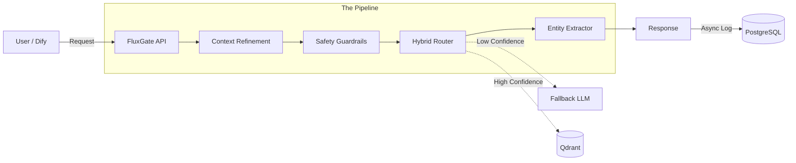

# 🌊 FluxGate AI

**The Intelligent Control Plane for AI Agents**

[](LICENSE)
[](https://www.python.org/)
[](docker/)
[](")
[](docs/integrations/dify.md)

**FluxGate AI** is a high-performance middleware designed to act as the "Cerebellum" (System 1) for your AI Agents. It sits between user inputs and your LLMs, providing **sub-200ms intent routing**, **entity extraction**, and **safety guardrails**.

Stop burning GPT-4 tokens on simple queries. Gain deterministic control over your agent's behavior.

**[Get Started](#-quick-start)** | **[Documentation](docs/)** | **[Dify Integration](docs/integrations/dify.md)**

---

## 🚀 Why FluxGate?

Building production-grade agents faces an "Impossible Triangle": **Low Latency**, **Low Cost**, and **High Determinism**. FluxGate solves this by offloading decision-making from the LLM to a specialized routing engine.

| Feature | Without FluxGate (Pure LLM) | With FluxGate AI |
| :--- | :--- | :--- |
| **Latency** | 1.5s - 3.0s | **< 50ms** (L1) / **< 200ms** (L2) |
| **Cost** | High ($0.03 / query) | **Near Zero** (Vector Search) |
| **Consistency** | Hallucinations possible | **100% Deterministic** on defined intents |
| **Context** | Struggle with "Yes/No" | **Auto-Rewriting** for multi-turn context |

---

## ✨ Key Features

- **⚡ Hybrid Routing Engine**:
    - **L1 (Exact)**: Hash/Keyword matching for ultra-fast responses (<10ms).
    - **L2 (Semantic)**: Vector-based routing using `semantic-router` & Qdrant (<200ms).
    - **L3 (Fallback)**: Graceful fallback to lightweight LLMs (e.g., GPT-4o-mini) when confidence is low.

- **🧠 Contextual Intelligence**:
    - Automatically rewrites queries based on chat history (e.g., "It's too expensive" -> "The iPhone 15 is too expensive") before routing.

- **⛏️ Zero-Shot Entity Extraction**:
    - Integrated **GLiNER** to extract parameters (Time, Location, Order ID) without training specific models.

- **🛡️ Enterprise Guardrails**:
    - Pre-flight checks for PII (Sensitive Data), Prompt Injection, and Toxic Language.

- **👻 Shadow Mode**:
    - Run FluxGate in the background to analyze traffic and estimate ROI without affecting production users.

---

## 🛠️ Architecture

FluxGate acts as a Gateway Service, perfect for integrating with **Dify**, **LangChain**, or **Higress**.



---

## ⚡ Quick Start

### Prerequisites
*   Docker & Docker Compose
*   OpenAI API Key (for Embeddings/Fallback)

### 1. Clone & Run
```bash
git clone https://github.com/wsyjwps1983/FluxGate.git
cd fluxgate-ai

# Copy env example
cp .env.example .env
# Edit .env to add your OPENAI_API_KEY

# Start services (API, Postgres, Qdrant, Redis)
docker-compose up -d
```

### 2. Configure an Intent (via API)
```bash
curl -X POST http://localhost:8000/v1/intents \
  -H "Content-Type: application/json" \
  -d '{
    "app_id": "default",
    "name": "refund_request",
    "description": "User wants to return a product",
    "utterances": [
      "I want a refund",
      "return this item",
      "money back please"
    ],
    "parameters": [
      {"name": "order_id", "type": "string"}
    ]
  }'
```

### 3. Sync & Build Index
```bash
curl -X POST http://localhost:8000/v1/apps/default/sync
```

### 4. Make a Prediction
```bash
curl -X POST http://localhost:8000/v1/predict \
  -H "Content-Type: application/json" \
  -d '{
    "app_id": "default",
    "query": "I bought this last week but it is broken, can I return it?",
    "history": []
  }'
```

**Response:**
```json
{
  "intent": "refund_request",
  "confidence": 0.94,
  "source": "semantic_router",
  "entities": {
    "time": "last week",
    "reason": "broken"
  },
  "recommendation": "execute"
}
```

---

## 🔌 Integration with Dify

FluxGate is designed to be the "Brain" of your Dify Workflow.

1.  Go to **FluxGate Dashboard** -> **Integrations**.
2.  Download the `openapi-schema.json`.
3.  In **Dify**, go to **Tools** -> **Custom Tool** -> **Import from JSON**.
4.  In your Workflow, add the FluxGate Tool at the very beginning.
5.  Use a **Logical Branch (If/Else)** node to route based on `sys.tool_output.intent`.

> 👉 [Read the full Dify Integration Guide](docs/integrations/dify.md)

---

## 🗺️ Roadmap

- [x] **MVP**: Hybrid Routing & Dify Support
- [ ] **v0.2**: Web Management Dashboard (Intent CRUD)
- [ ] **v0.3**: Shadow Mode & Analytics Dashboard
- [ ] **v0.4**: Auto-Discovery of Intents (Clustering)
- [ ] **v1.0**: Higress / Nacos Native Integration

---

## 📚 Resources

### Documentation

- [API Usage Manual](docs/API_USAGE_MANUAL.md)
- [Deployment Guide](docs/DEPLOYMENT_GUIDE.md)
- [Threshold Optimization](docs/THRESHOLD_OPTIMIZATION.md)

### Examples

| Example | Description |
| -------- | ----------- |
| [Dynamic Routes](docs/02-dynamic-routes.ipynb) | Dynamic routes for parameter generation and function calls |
| [Local Execution](docs/05-local-execution.ipynb) | Fully local FluxGate with dynamic routes |
| [Hybrid Router](docs/examples/hybrid-router.ipynb) | Using HybridRouter for improved performance |
| [SiliconFlow Integration](build_router_with_siliconflow.py) | Example of using SiliconFlowEncoder |

---

## 🤝 Contributing

We welcome contributions! Please see [CONTRIBUTING.md](CONTRIBUTING.md) for details on how to set up the development environment and submit PRs.

## 📄 License

This project is licensed under the MIT License - see the [LICENSE](LICENSE) file for details.