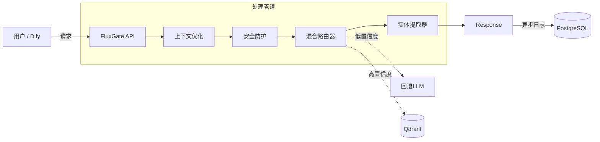

# 🌊 FluxGate AI

**AI智能体的智能控制平面**

## 📖 项目介绍

**FluxGate AI** 是一个以 [Semantic Router](https://github.com/aurelio-labs/semantic-router) 为基础进行二次开发的高性能中间件，设计作为AI智能体的「小脑」(系统1)，位于用户输入和大语言模型(LLM)之间，提供**亚200ms的意图路由**、**实体提取**和**安全防护**能力。

通过将决策逻辑从LLM中分离出来，FluxGate帮助开发者显著降低API调用成本、提高响应速度并增强系统的确定性，为构建生产级AI应用提供可靠的基础。

## 🚀 为什么选择FluxGate?

构建生产级智能体面临「不可能三角」：**低延迟**、**低成本**和**高确定性**。FluxGate通过将决策任务从LLM卸载到专用的路由引擎来解决这一挑战。

| 特性 | 不使用FluxGate (纯LLM) | 使用FluxGate AI |
| :--- | :--- | :--- |
| **延迟** | 1.5秒 - 3.0秒 | **< 50ms** (L1) / **< 200ms** (L2) |
| **成本** | 高 ($0.03/查询) | **几乎为零** (向量搜索) |
| **一致性** | 可能产生幻觉 | **100%确定性** (已定义意图) |
| **上下文** | 难以处理"是/否"等简短回答 | **自动重写**多轮对话上下文 |

## ✨ 核心功能

- **⚡ 混合路由引擎**：
    - **L1 (精确)**：哈希/关键词匹配，响应速度<10ms
    - **L2 (语义)**：基于向量的路由，使用`semantic-router`和Qdrant，响应速度<200ms
    - **L3 (回退)**：当置信度低时，优雅地回退到轻量级LLM(如GPT-4o-mini)

- **🧠 上下文智能**：
    - 基于聊天历史自动重写查询(例如："太贵了"→"iPhone 15太贵了")，然后再进行路由

- **⛏️ 零样本实体提取**：
    - 集成**GLiNER**，无需训练特定模型即可提取参数(时间、地点、订单ID等)

- **🛡️ 企业级安全防护**：
    - 对PII(敏感数据)、提示词注入和有害语言进行预检查

- **👻 影子模式**：
    - 在不影响生产用户的情况下，在后台运行FluxGate分析流量并估算ROI

## 🔧 架构

FluxGate作为网关服务，完美集成**Dify**、**LangChain**或**Higress**。

## 🛣️ 产品路线图

FluxGate的开发路线图如下：

- [x] **MVP**：混合路由和Dify支持
- [ ] **v0.2**：Web管理控制台(意图CRUD操作)
- [ ] **v0.3**：影子模式和分析仪表板
- [ ] **v0.4**：意图自动发现(聚类)
- [ ] **v1.0**：Higress/Nacos原生集成

## 🤝 贡献

我们欢迎贡献！请查看[CONTRIBUTING.md](CONTRIBUTING.md)了解如何设置开发环境并提交PR。

## 📄 许可证

本项目采用MIT许可证 - 详见[LICENSE](LICENSE)文件。